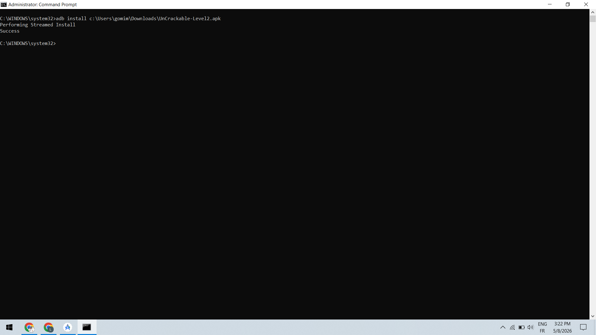
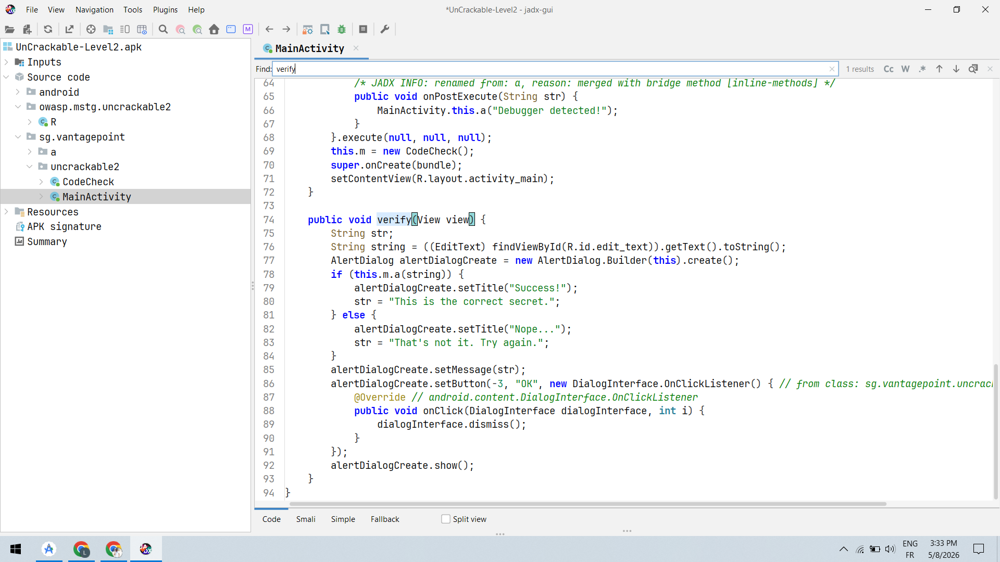
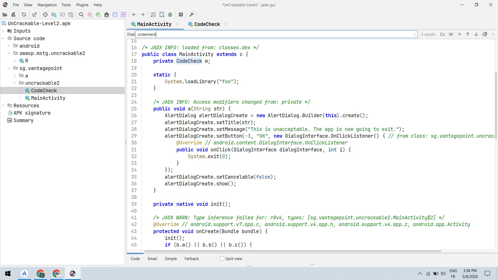
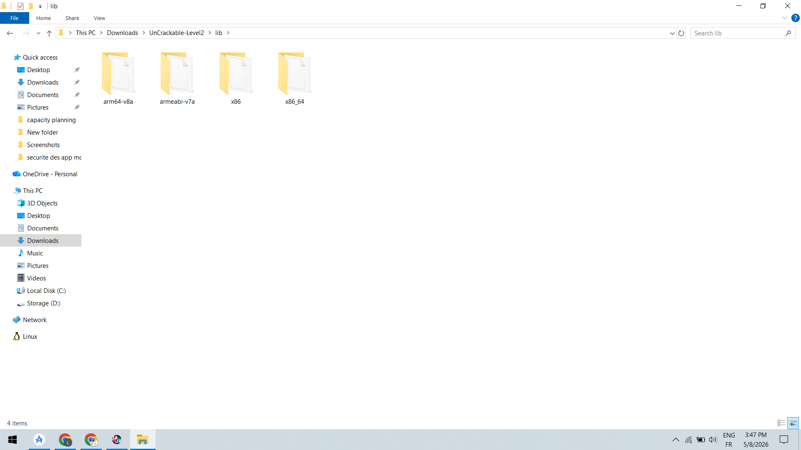
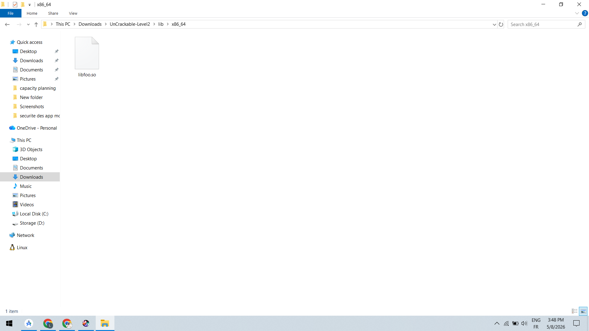
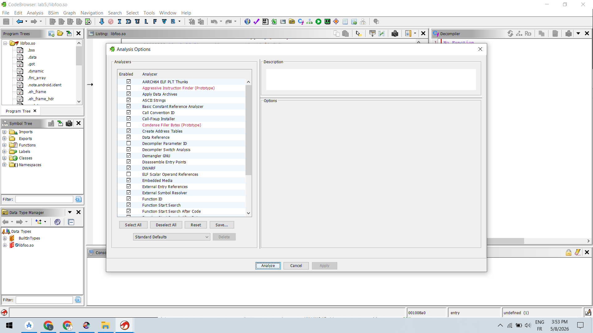
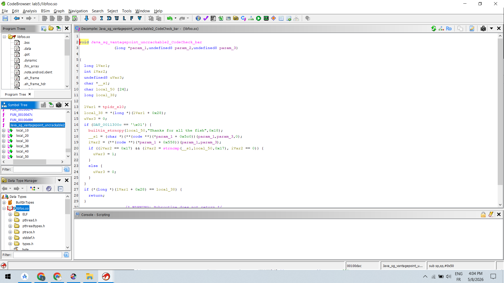
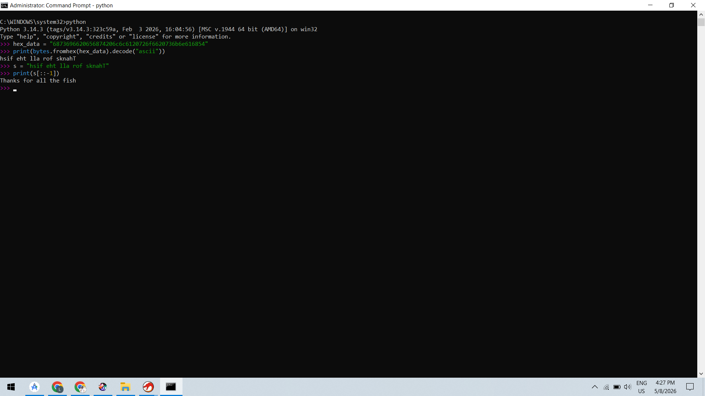

# Analyse native de UnCrackable-Level2 avec JADX et Ghidra

## Présentation

Ce laboratoire consiste à analyser l’application Android **UnCrackable-Level2.apk** afin de comprendre comment la vérification du mot secret est réalisée dans une bibliothèque native (`libfoo.so`).

L’objectif est de :

* Identifier la bibliothèque native utilisée par l’application
* Charger la bibliothèque dans Ghidra
* Retrouver la fonction JNI appelée depuis Java
* Comprendre le fonctionnement de `strncmp`
* Identifier la chaîne secrète utilisée par l’application
* Décoder une valeur hexadécimale ASCII

---

# Étape 1 — Installation de l’application Android

L’application a été installée sur l’émulateur Android avec ADB.

Commande utilisée :

```bash
adb install c:\Users\gomim\Downloads\UnCrackable-Level2.apk
```

Résultat observé :

* Installation réussie
* Message `Success`

## Capture



---

# Étape 2 — Recherche de la méthode verify dans JADX

L’application a été ouverte dans JADX afin d’analyser le code Java.

La méthode `verify(View view)` a été identifiée dans `MainActivity`.

Cette méthode :

* Récupère le texte saisi par l’utilisateur
* Appelle une fonction de vérification
* Affiche un message de succès ou d’échec

Code important observé :

```java
if (this.m.a(string)) {
```

Cela montre qu’un objet `CodeCheck` effectue la validation.

## Capture



---

# Étape 3 — Analyse de la classe CodeCheck

La classe `CodeCheck` a été ouverte dans JADX.

Observation importante :

```java
System.loadLibrary("foo");
```

Cela indique que l’application charge une bibliothèque native appelée :

```text
libfoo.so
```

La présence du mot-clé `native` montre que certaines fonctions sont implémentées en C/C++.

## Capture



---

# Étape 4 — Recherche de la bibliothèque native

Après extraction de l’APK, le dossier `lib` contient plusieurs architectures Android :

* arm64-v8a
* armeabi-v7a
* x86
* x86_64

Chaque dossier contient une version compilée de la bibliothèque native.

## Capture



---

# Étape 5 — Sélection de la bibliothèque x86_64

L’émulateur utilisé fonctionne en architecture x86_64.

Le fichier sélectionné pour l’analyse est donc :

```text
libfoo.so
```

situé dans :

```text
lib/x86_64/
```

## Capture



---

# Étape 6 — Chargement de la bibliothèque dans Ghidra

La bibliothèque native `libfoo.so` a été importée dans Ghidra.

L’analyse automatique a été lancée afin de :

* Détecter les fonctions
* Reconstruire le pseudo-code
* Identifier les appels JNI
* Retrouver les chaînes ASCII

## Capture



---

# Étape 7 — Analyse de la fonction JNI

La fonction JNI suivante a été identifiée :

```c
Java_sg_vantagepoint_uncrackable2_CodeCheck_bar
```

Le pseudo-code montre :

```c
builtin_strncpy(local_50,"Thanks for all the fish",0x18);
```

Puis :

```c
strncmp(__s1,local_50,0x17)
```

Explication :

* `local_50` contient la chaîne secrète
* `strncmp` compare l’entrée utilisateur avec cette chaîne
* Si les deux chaînes sont identiques, la validation réussit

La chaîne secrète identifiée est :

```text
Thanks for all the fish
```

## Capture



---

# Étape 8 — Décodage de la valeur hexadécimale ASCII

Une valeur hexadécimale ASCII a ensuite été analysée :

```text
6873696620656874206c6c6120726f6620736b6e616854
```

Décodage Python utilisé :

```python
hex_data = "6873696620656874206c6c6120726f6620736b6e616854"
print(bytes.fromhex(hex_data).decode("ascii"))
```

Résultat obtenu :

```text
hsif eht lla rof sknahT
```

La chaîne étant inversée, une inversion a été appliquée :

```python
s = "hsif eht lla rof sknahT"
print(s[::-1])
```

Résultat final :

```text
Thanks for all the fish
```

## Capture



---

# Conclusion

Cette analyse a permis de comprendre comment une application Android peut déplacer une vérification sensible dans une bibliothèque native.

Les principales découvertes sont :

* Utilisation d’une bibliothèque native `libfoo.so`
* Présence d’une fonction JNI de validation
* Utilisation de `strncmp` pour comparer une chaîne secrète
* Identification du secret :

```text
Thanks for all the fish
```

* Décodage d’une représentation hexadécimale ASCII

Ce laboratoire montre l’intérêt de l’analyse statique avec JADX et Ghidra pour comprendre le fonctionnement interne d’une application Android native.
